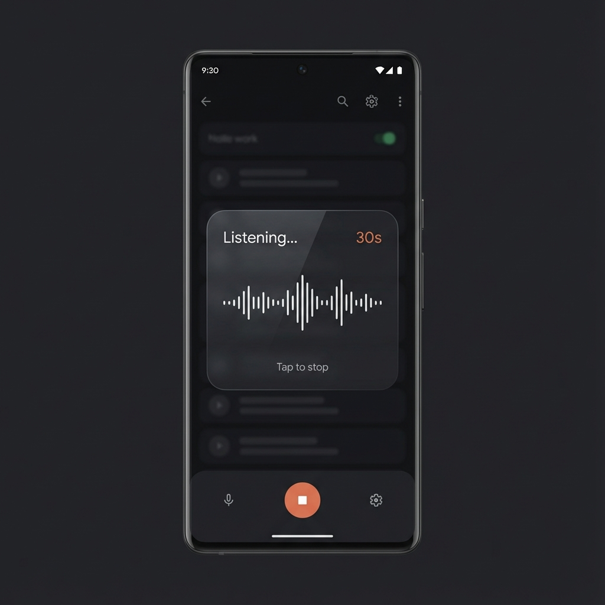
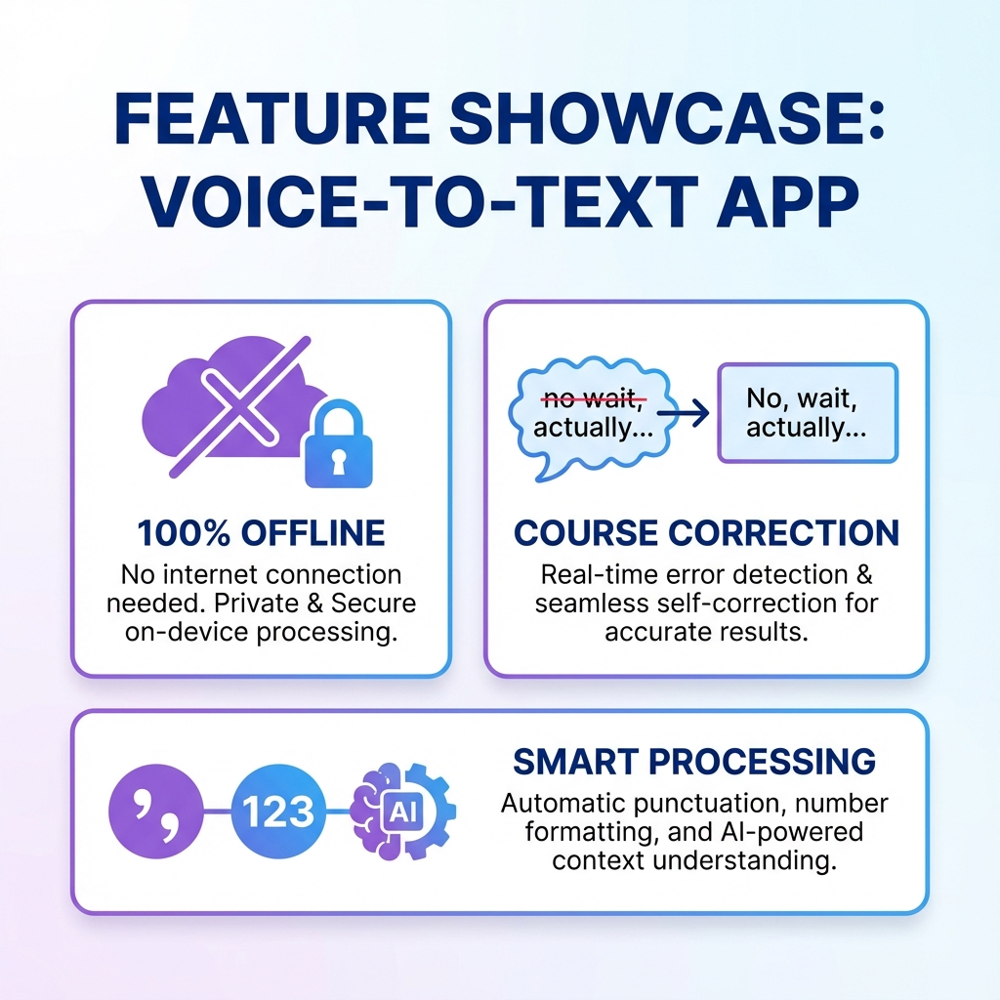

# 🎤 VoiceAI

<div align="center">


**A Wispr Flow offline alternative for Android**

Fully local voice dictation with advanced AI post-processing

[](../../releases/latest)
[](https://developers.google.com/project-antigravity)
[](LICENSE)
[](https://developer.android.com)

</div>

---

## 🖼️ Screenshots

<div align="center">
<table>
<tr>
<td align="center"><br/><b>Dictation Overlay</b></td>
<td align="center"><br/><b>Key Features</b></td>
</tr>
</table>
</div>

---

## 🆕 What's New in v1.1.0

| Feature | Description |
|---------|-------------|
| 🎯 **Course Correction** | "No wait" / "I mean" → Clean output (Wispr's killer feature!) |
| 🗣️ **Voice Commands** | "Delete that", "new paragraph", "period", "comma" |
| 📦 **Modular Pipeline** | 8 specialized processors with clean architecture |
| 📳 **Haptic Feedback** | Subtle vibration on start/stop |
| 🤖 **Phi-2 Ready** | On-device LLM integration prepared |

---

## ✨ Features

<div align="center">

| Feature | Description |
|---------|-------------|
| 🔒 **100% Offline** | No internet required — all processing on-device |
| ⚡ **Fast Transcription** | NVIDIA Parakeet TDT 0.6B model (int8 quantized) |
| 🎯 **Course Correction** | "No wait, I mean..." → Clean, corrected output |
| 🗣️ **Voice Commands** | "Period", "comma", "new line", "delete that" |
| 🧠 **Smart Post-Processing** | Punctuation, casing, numbers, fillers removed |
| 📖 **Personal Dictionary** | FUTO-style custom word replacements |
| ⏱️ **30-Second Timer** | Optional auto-stop after 30 seconds |
| 🔇 **Silence Detection** | Auto-stop when you stop speaking |
| 🌐 **Universal Injection** | Works with any app via Accessibility Service |

</div>

---

## 📱 Tested Keyboards

| Keyboard | Status |
|----------|--------|
| [HeliBoard](https://github.com/Helium314/HeliBoard) | ✅ Working |
| [SwiftKey](https://www.microsoft.com/swiftkey) | ✅ Working |
| [GBoard](https://play.google.com/store/apps/details?id=com.google.android.inputmethod.latin) | ✅ Working |

---

## 🚀 Quick Start

### Download & Install

1. **Download** [`VoiceAI-v1.1.0.apk`](../../releases/latest) from Releases
2. **Install** on your Android device
3. **Enable** in Settings → Language & Input → Keyboards
4. **Enable** Accessibility Service for text injection
5. **Grant** microphone permission

### Usage

1. Open any text field in any app
2. Tap the **microphone button** on your keyboard
3. Speak naturally — use voice commands if needed
4. Tap screen or wait for auto-stop

---

## 🎯 Post-Processing Examples

### Course Correction (NEW!)

| You Say | VoiceAI Outputs |
|---------|-----------------|
| "Let's meet tomorrow no wait let's do Friday" | **Let's do Friday.** |
| "I think um actually never mind I mean yes" | **Yes.** |
| "Send to John no sorry to Mike" | **Send to Mike.** |

### Voice Commands (NEW!)

| You Say | VoiceAI Does |
|---------|--------------|
| "Hello comma how are you question mark" | **Hello, how are you?** |
| "New paragraph" | Inserts paragraph break |
| "Delete that" | Removes last dictation |

### Smart Formatting

| You Say | VoiceAI Outputs |
|---------|-----------------|
| "twenty five percent" | **25%** |
| "one hundred US dollars" | **$100 USD** |
| "twenty twenty four" | **2024** |
| "four twenty pm" | **4:20 PM** |
| "uh so i was thinking um" | **So, I was thinking** |

---

## ⚙️ Settings

Access via **VoiceAI app → Open Settings**:

- **⏱️ 30-Second Limit** — Auto-stop after 30 seconds
- **🔇 Silence Detection** — Auto-stop when you stop speaking  
- **📖 Personal Dictionary** — Add custom words (e.g., `@Groq, ChatGPT, Anthropic`)
- **🔑 Groq API Key** — Optional LLM-powered post-processing

---

## 🏗️ Architecture

```
VoiceAIPipeline (Chain of Responsibility)
├── CommandInterpreter     # Voice commands first
├── CourseCorrector        # "No wait" handling
├── RepetitionCleaner      # Stutter removal
├── PersonalDictionary     # Custom words
├── FillerRemover          # "Uh", "um" removal
├── NumberNormalizer       # "25" from "twenty five"
├── PunctuationRestorer    # Add periods, commas
└── CasingApplicator       # Proper nouns
```

---

## 🛠️ Tech Stack

### Frontend
- **Rust** + `egui` — Native Android UI
- **Java** — Activities, Services, Accessibility

### Backend / AI
- **ONNX Runtime** — Neural network inference
- **Parakeet TDT 0.6B** — NVIDIA's speech-to-text model
- **Phi-2 (Planned)** — On-device LLM for AI commands

### Build
- **Cargo** — Rust package manager
- **Android SDK/NDK** — Native compilation

---

## 🏗️ Building from Source

```bash
# Clone
git clone https://github.com/ai-dev-2024/VoiceAI.git
cd VoiceAI

# Download model files (required)
# From: https://huggingface.co/nvidia/parakeet-tdt-0.6b
# Place in: assets/parakeet-tdt-0.6b-v3-int8/

# Build (Windows PowerShell)
./build.ps1

# Install
adb install -r VoiceAI-v1.1.0.apk
```

**Requirements:**
- Android SDK (API 36)
- Android NDK 28
- Rust toolchain with `aarch64-linux-android` target
- Parakeet TDT 0.6B model files (~600MB)

---

## 🙏 Credits & Acknowledgments

| Project | Contribution |
|---------|--------------|
| [**transcribe-rs**](https://github.com/handy-audio/transcribe-rs) | Core ASR Rust library |
| [**FUTO Voice Input**](https://gitlab.futo.org/alex/voiceinput) | Personal dictionary inspiration |
| [**Wispr Flow**](https://wispr.com/flow) | Course correction concept |
| **NVIDIA NeMo** | Parakeet TDT speech model |
| **Microsoft Phi-2** | On-device LLM (planned) |

---

## 📄 License

MIT License — See [LICENSE](LICENSE) for details.

---

<div align="center">

**VoiceAI** — Voice dictation, reimagined for Android.

*Offline. Private. Fast.*

⭐ **Star this repo if you find it useful!** ⭐

</div>
